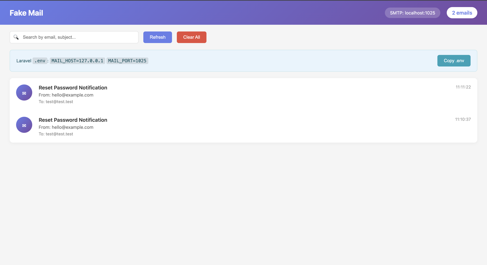
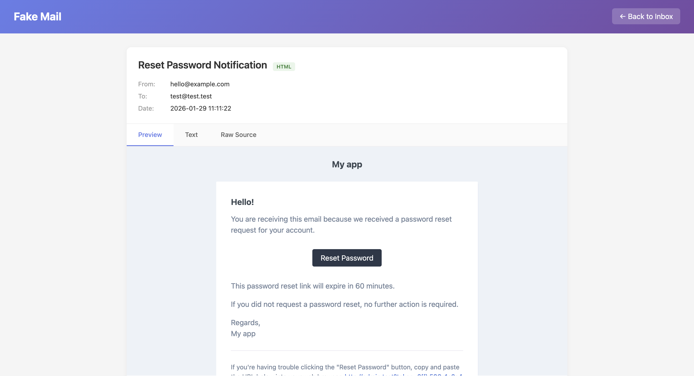

<div align="center">

# 📬 Fake Mail

**Локальный SMTP сервер для тестирования email с веб-интерфейсом**

[](https://github.com/zhandos717/mailfake/actions/workflows/ci.yml)
[](https://github.com/zhandos717/mailfake/actions/workflows/release.yml)
[](https://go.dev/)
[](LICENSE)
[](https://www.docker.com/)

Простая и легковесная альтернатива Mailhog, Mailtrap и MailCatcher.

[Возможности](#-возможности) •
[Установка](#-установка) •
[Использование](#-использование) •
[API](#-api) •
[Docker](#-docker)

</div>

---

## 📸 Скриншоты

<p align="center">
  
</p>

<p align="center">
  
</p>

## ✨ Возможности

- 📨 **SMTP сервер** — принимает письма на порту 1025
- 🌐 **Веб-интерфейс** — просмотр писем на порту 8025
- 🔍 **Поиск** — по адресам отправителя/получателя и теме
- 📄 **HTML & Text** — корректное отображение HTML писем
- 📋 **Копирование конфига** — одним кликом
- 🗑️ **Управление** — удаление писем по одному или всех сразу
- 🔌 **REST API** — интеграция с CI/CD
- 🐳 **Docker** — готовый образ

## 🚀 Установка

### Go

```bash
go install github.com/zhandos717/mailfake/cmd@latest
```

### Из исходников

```bash
git clone https://github.com/zhandos717/mailfake.git
cd fake-mail
make build
./bin/fake-mail
```

### Docker

```bash
docker run -p 1025:1025 -p 8025:8025 ghcr.io/zhandos717/mailfake
```

## 📖 Использование

```bash
# Запуск
./fake-mail

# Или через Make
make run
```

После запуска:
| Сервис | Адрес |
|--------|-------|
| SMTP | `localhost:1025` |
| Web UI | http://localhost:8025 |

## ⚙️ Настройка приложений

<details>
<summary><b>Laravel</b></summary>

```env
MAIL_MAILER=smtp
MAIL_HOST=127.0.0.1
MAIL_PORT=1025
MAIL_USERNAME=null
MAIL_PASSWORD=null
MAIL_ENCRYPTION=null
```
</details>

<details>
<summary><b>Django</b></summary>

```python
EMAIL_BACKEND = 'django.core.mail.backends.smtp.EmailBackend'
EMAIL_HOST = '127.0.0.1'
EMAIL_PORT = 1025
EMAIL_USE_TLS = False
```
</details>

<details>
<summary><b>Node.js (Nodemailer)</b></summary>

```javascript
const transporter = nodemailer.createTransport({
  host: '127.0.0.1',
  port: 1025,
  secure: false,
});
```
</details>

<details>
<summary><b>Ruby on Rails</b></summary>

```ruby
config.action_mailer.delivery_method = :smtp
config.action_mailer.smtp_settings = {
  address: '127.0.0.1',
  port: 1025
}
```
</details>

<details>
<summary><b>Go</b></summary>

```go
import "net/smtp"

smtp.SendMail("127.0.0.1:1025", nil, "from@test.com",
    []string{"to@test.com"}, []byte(message))
```
</details>

<details>
<summary><b>Python</b></summary>

```python
import smtplib

with smtplib.SMTP('127.0.0.1', 1025) as server:
    server.sendmail('from@test.com', 'to@test.com', message)
```
</details>

<details>
<summary><b>Symfony</b></summary>

```yaml
framework:
  mailer:
    dsn: 'smtp://127.0.0.1:1025'
```
</details>

<details>
<summary><b>Spring Boot</b></summary>

```properties
spring.mail.host=127.0.0.1
spring.mail.port=1025
```
</details>

## 🔌 API

| Метод | Endpoint | Описание |
|-------|----------|----------|
| `GET` | `/api/emails` | Список всех писем |
| `GET` | `/html/{id}` | HTML контент письма |
| `DELETE` | `/api/emails/{id}` | Удалить письмо |
| `POST` | `/api/clear` | Удалить все письма |

### Примеры

```bash
# Получить все письма
curl http://localhost:8025/api/emails

# Удалить письмо
curl -X DELETE http://localhost:8025/api/emails/1

# Очистить все
curl -X POST http://localhost:8025/api/clear
```

## 🐳 Docker

### Docker Compose

```yaml
services:
  fake-mail:
    image: ghcr.io/zhandos717/mailfake
    ports:
      - "1025:1025"
      - "8025:8025"
```

```bash
docker-compose up -d
```

### Dockerfile

```bash
docker build -t fake-mail .
docker run -p 1025:1025 -p 8025:8025 fake-mail
```

## 🏗️ Структура проекта

```
fake-mail/
├── cmd/
│   └── main.go              # Точка входа
├── internal/
│   ├── smtp/
│   │   └── server.go        # SMTP сервер
│   ├── store/
│   │   └── store.go         # Хранилище писем
│   └── web/
│       ├── server.go        # HTTP сервер
│       └── templates/       # HTML шаблоны
├── docs/                    # Скриншоты
├── Dockerfile
├── docker-compose.yml
├── Makefile
└── README.md
```

## 🛠️ Разработка

```bash
# Установка зависимостей
go mod download

# Запуск в dev режиме
make run

# Сборка
make build

# Сборка для всех платформ
make build-all

# Линтер
make lint

# Тесты
make test
```

## 🤝 Contributing

1. Fork репозитория
2. Создайте feature branch (`git checkout -b feature/amazing`)
3. Commit изменения (`git commit -m 'Add amazing feature'`)
4. Push в branch (`git push origin feature/amazing`)
5. Откройте Pull Request

## 📄 Лицензия

MIT License. Смотрите [LICENSE](LICENSE) для деталей.

---

<div align="center">

**[⬆ Наверх](#-fake-mail)**

</div>
